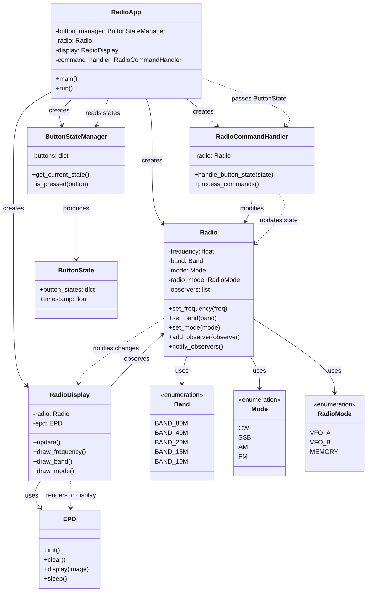

# ePaper UI Proof of Concept

See [Notes](NOTES.md) for device, build, and resource information


## System Architecture

The following diagram illustrates the relationships between the main classes in the ePaperPoC project:



### Key Relationships

- **RadioApp** serves as the main orchestrator, creating and coordinating all other components
- **Radio** implements the observer pattern, notifying **RadioDisplay** of state changes
- **ButtonStateManager** reads hardware button inputs and provides **ButtonState** objects
- **RadioCommandHandler** processes button combinations and updates **Radio** state
- **RadioDisplay** observes **Radio** changes and renders updates to the ePaper display via **EPD**
- The enums (**Band**, **Mode**, **RadioMode**) define the possible states for the radio

## Running the PoC

With this demo, you can use the keys:

* Key 4, VFO down
* Key 3, VFO up
* Key 1 and Key 2 simultaneously, band up
* Key 3 and Key 4 simultaneously, band down
* ALL to exit

```shell
python3 radio_app.py
```

## Screen function demos

```shell
python3 display_demo.py
```

## Fonts

You will need to obtain the [Audiowide-Regular.ttf font from Google](https://fonts.google.com/specimen/Audiowide) and place it in the fonts subdirectory.
